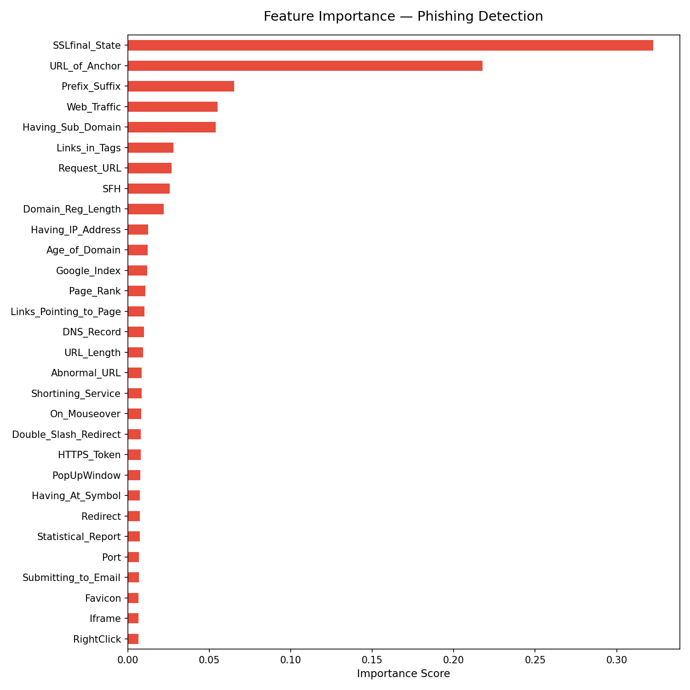

# 🎣 Phishing Website Detector

> A machine learning system that analyses website characteristics to detect phishing attempts.
> Built as a cybersecurity portfolio project using Python, scikit-learn, and Streamlit.

## 🔴 Live Demo
👉 **[Try the app here](https://phishing-detector-abree.streamlit.app/)** ← replace with your Streamlit link after deploying

---

## 📌 Project Overview

Phishing attacks are one of the most common cybersecurity threats, tricking users into
revealing credentials on fake websites. This project builds a machine learning classifier
that analyses 30 website characteristics — such as SSL certificate validity, URL structure,
and domain age — to determine whether a site is likely phishing or legitimate.

The model achieves **89% accuracy** on the UCI Phishing Dataset (11,055 samples), with
**92% recall on phishing sites** — meaning it correctly catches 9 out of 10 phishing attempts.

---

## How It Works

The classifier is a **Random Forest** trained on the
[UCI Machine Learning Phishing Dataset](https://archive.ics.uci.edu/ml/datasets/phishing+websites).
Each website is represented by 30 binary/ternary features encoding structural and
behavioural characteristics of the URL and page.

### Top Features by Importance

| Feature | Importance | What It Means |
|---|---|---|
| SSLfinal_State | 32% | Valid SSL certificate from trusted authority |
| URL_of_Anchor | 21% | % of links pointing to external domains |
| Prefix_Suffix | 6.5% | Hyphen used in domain name |
| Web_Traffic | 5.5% | Site has measurable traffic rank |
| Having_Sub_Domain | 5.4% | Multiple subdomains in URL |



---

## Model Performance

Trained on 8,844 samples, tested on 2,211 samples (80/20 split):
precision    recall  f1-score   support
   Legit       0.90      0.84      0.87       980
Phishing       0.88      0.92      0.90      1231
accuracy                           0.89      2211
**Confusion Matrix:**
- ✅ 828 legitimate sites correctly identified
- ✅ 1,136 phishing sites correctly identified
- ⚠️ 95 phishing sites missed (false negatives)
- ⚠️ 152 legitimate sites incorrectly flagged (false positives)

> The model is tuned to prioritise catching phishing sites (high recall) over avoiding
> false alarms — in security, missing a real threat is more costly than a false positive.

---

## Tech Stack

| Tool | Purpose |
|---|---|
| Python 3.9+ | Core language |
| pandas & numpy | Data wrangling |
| scikit-learn | Model training and evaluation |
| matplotlib & seaborn | Visualisations |
| Streamlit | Web application |
| plotly | Interactive gauge chart |
| joblib | Model serialisation |

---

## Installation

> The raw data files are not included in this repo due to size.
> Download the UCI dataset from the link above and place it in the `data/` folder.

```bash
# 1. Clone the repo
git clone https://github.com/ABree24/phishing-detector.git
cd phishing-detector

# 2. Create and activate virtual environment
python -m venv venv
venv\Scripts\activate        # Windows
source venv/bin/activate     # macOS/Linux

# 3. Install dependencies
pip install -r requirements.txt

# 4. Prepare the data
python notebooks/01_data_prep.py

# 5. Train the model
python src/model_trainer.py

# 6. Run the app
streamlit run app.py
```

---

## 💡 What I Learned

- **Data quality matters more than model complexity** — I initially achieved 100% accuracy
  which turned out to be caused by class imbalance and data leakage between two poorly
  matched datasets. Switching to the UCI benchmark dataset gave a realistic 89%.

- **Feature importance tells a security story** — SSL certificate state being the strongest
  predictor (32%) makes intuitive sense; phishing sites either skip HTTPS or use untrusted
  certificates because they can't obtain legitimate ones for domains they don't own.

- **False negatives vs false positives** — In security contexts, missing a phishing attack
  (false negative) is more dangerous than flagging a legitimate site (false positive). This
  influenced how I evaluated and communicate the model's performance.

- **Clean Git hygiene** — Learned to properly configure `.gitignore` to exclude large data
  files and virtual environments, and handled a secret scanning alert caused by attacker
  Telegram tokens embedded inside PhishTank phishing URLs.

---

## Future Improvements

- Add live URL input using WHOIS and VirusTotal API for real-time checking
- Retrain with a larger, more recent phishing dataset
- Add email header analysis as a second detection mode
- Experiment with XGBoost and compare performance against Random Forest

---

## Project Structure
phishing-detector/
├── assets/             # Images and icons
├── models/             # Saved model files (.pkl)
├── notebooks/          # Data prep and visualisation scripts
├── src/                # Core modules
│   ├── feature_extractor.py
│   └── model_trainer.py
├── app.py              # Streamlit web application
├── requirements.txt    # Dependencies
└── README.md
---

*Built by ABree24 · UCI Phishing Dataset · scikit-learn · Streamlit*